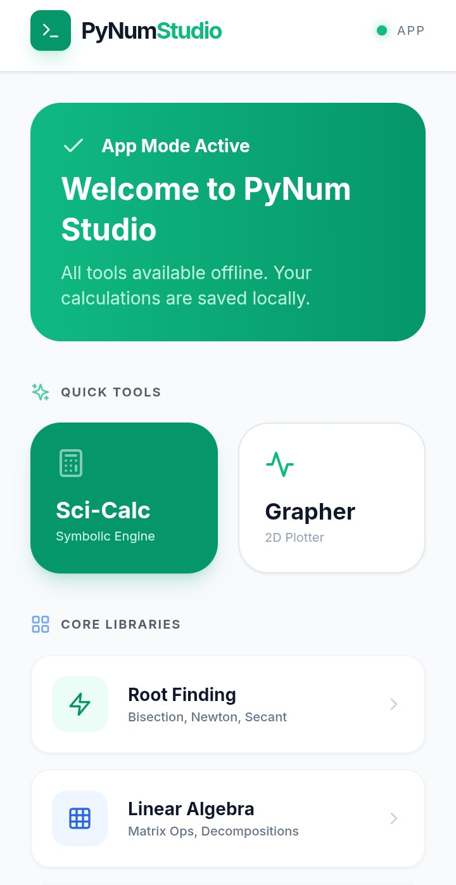

# PyNum Studio

**Visualize Numerical Methods Instantly**

PyNum Studio is a professional-grade numerical suite designed for engineers, scientists, and students. It offers interactive simulations, production-ready code generation, and a powerful symbolic math engine—all accessible from your browser or as a native app.

[](#) 

## ✨ Key Features

PyNum Studio is engineered for accuracy and flexibility, providing a comprehensive environment for numerical computing.

### 🧮 Core Numerical Methods

Explore a wide range of algorithms with real-time, step-by-step visualizations.

*   **Root Finding**: Master non-linear equations with interactive tools for **Bisection**, **Newton-Raphson**, **Fixed-Point**, and **Secant** methods.
*   **Linear Algebra**: Solve massive systems of equations using **Gaussian Elimination**, **LU Decomposition**, **QR Decomposition**, and the **Gauss-Seidel** method.
*   **Interpolation**: Construct smooth curves through discrete points using **Cubic Splines**, **Lagrange polynomials**, and **Newton's divided differences**.
*   **Calculus Suite**: Perform numerical integration and solve ODEs for complex dynamical systems with **Runge-Kutta**, **Simpson's Rule**, and the **Trapezoidal Rule**.

### 💻 Production-Ready Code Generation

Instantly export your algorithms to high-performance, production-ready code in multiple languages:
*   **Python 3**
*   **C++17**
*   **Fortran 90**

### 📱 Cross-Platform & Offline Ready

Access your calculations anywhere, anytime.
*   **Web Studio**: Full functionality in your browser (PWA support).
*   **Mobile App**: A distraction-free environment for engineering math, fully functional without an internet connection. An **Android APK** is available for download.

## 🚀 Live Demo & Download

*   **Try the Web Studio**: [https://shahaduddin.com/pynum](https://shahaduddin.com/pynum)
*   **Download Android APK**: Available directly on the website (v2.2.4 Verified).

## 🛠️ Built With

*(This section should list the key technologies you used. Please update them to match your actual stack! Here are likely candidates based on the features:)*

*   **Frontend Framework**: [React](https://reactjs.org/)
*   **Language**: [TypeScript](https://www.typescriptlang.org/)
*   **Numerical Computing**: [math.js](https://mathjs.org/) – fast number crunching in TypeScript.
*   **Visualization**: [D3.js](https://d3js.org/) or [Chart.js](https://www.chartjs.org/)
*   **Code Generation**: Language-specific templates and transpilers
*   **Mobile**: [Capacitor](https://capacitorjs.com/) or [React Native](https://reactnative.dev/) for the Android APK
*   **Styling**: [Tailwind CSS](https://tailwindcss.com/)
*   **Deployment**: [Vercel](https://vercel.com/)

## 📦 Getting Started for Development

Follow these instructions to get a copy of the project up and running on your local machine for development and testing.

### Prerequisites

*   Node.js (v18 or later recommended)
*   npm, yarn, or pnpm
*   *(Add any other prerequisites, e.g., Rust for WASM, Python for backend, etc.)*

### Installation

1.  **Clone the repository**
    ```bash
    git clone https://github.com/shahaduddin/pynum.git
    cd pynum
    ```

2.  **Install dependencies**
    ```bash
    npm install
    # or
    yarn install
    # or
    pnpm install
    ```

3.  **Run the development server**
    ```bash
    npm run dev
    # or
    yarn dev
    # or
    pnpm dev
    ```

4.  Open [http://localhost:3000](http://localhost:3000) (or the port specified by your setup) to view it in the browser.

## 📱 Building the Mobile App (Android APK)

*(Provide specific instructions here if you want others to build the APK. For example:)*
To build the Android APK locally:
```bash
# Add your specific build commands, e.g., for Capacitor:
npm run build
npx cap sync android
npx cap open android
```
Then use Android Studio to generate a signed APK.

## 🤝 Contributing

Contributions are what make the open-source community such an amazing place to learn, inspire, and create. Any contributions you make are **greatly appreciated**.

If you have a suggestion that would make this better, please fork the repo and create a pull request. You can also simply open an issue with the tag "enhancement".

1.  Fork the Project
2.  Create your Feature Branch (`git checkout -b feature/AmazingFeature`)
3.  Commit your Changes (`git commit -m 'Add some AmazingFeature'`)
4.  Push to the Branch (`git push origin feature/AmazingFeature`)
5.  Open a Pull Request

## 📝 License

Distributed under the MIT License. See `LICENSE.txt` for more information.

## 📧 Contact

Shahad Uddin - [@theshahaduddin](https://twitter.com/theshahaduddin) - hello@shahaduddin.com
Project Link: [https://github.com/shahaduddin/pynum](https://github.com/shahaduddin/pynum)
